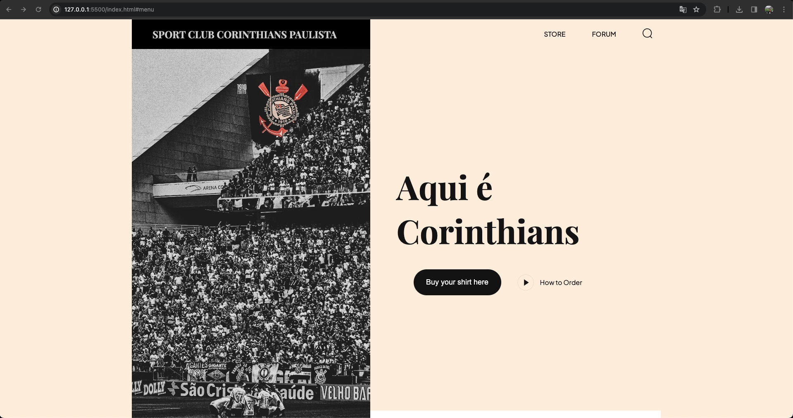
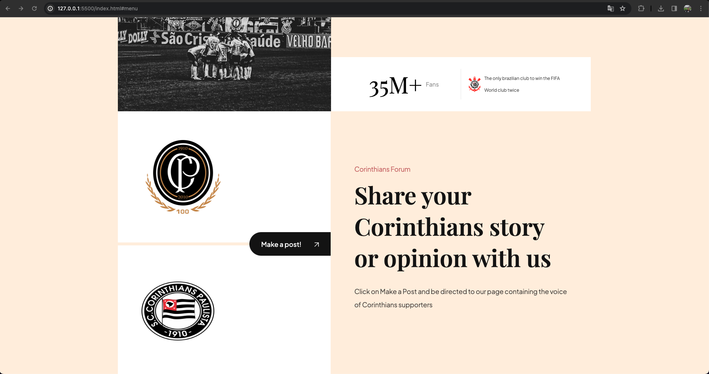
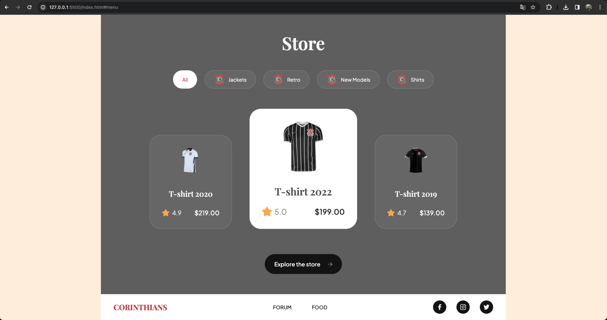

# Corinthians Fan Website

This website is a simple project created by Vitor Espindula da Rocha Latorraca to learn basic concepts of HTML, CSS, and JavaScript while combining his passion for the Corinthians football club. The goal was to make the learning experience more engaging and enjoyable by working on a project related to something he loves.

## About the Project

The project is a static website for fans of Sport Club Corinthians Paulista, one of the most popular football clubs in Brazil. It includes sections such as a hero banner showcasing the team's spirit, a forum section where fans can share their stories and opinions, and a store section where fans can explore and purchase team merchandise.

## Why Corinthians?

As a dedicated fan of Corinthians, Vitor wanted to create something that reflects his enthusiasm for the club while learning web development. By integrating his passion into the project, he aimed to make the learning process more immersive and rewarding.

## Technologies Used

- HTML
- CSS
- JavaScript

## How to Contribute

1. Fork the repository
2. Create your feature branch (`git checkout -b feature/AmazingFeature`)
3. Commit your changes (`git commit -m 'Add some AmazingFeature'`)
4. Push to the branch (`git push origin feature/AmazingFeature`)
5. Open a pull request

## Acknowledgements

- [AOS - Animate On Scroll Library](https://michalsnik.github.io/aos/)
- [Font Awesome](https://fontawesome.com/) - for icons

## License

Distributed under the MIT License. See `LICENSE` for more information.

## Contact

Vitor Espindula da Rocha Latorraca - 